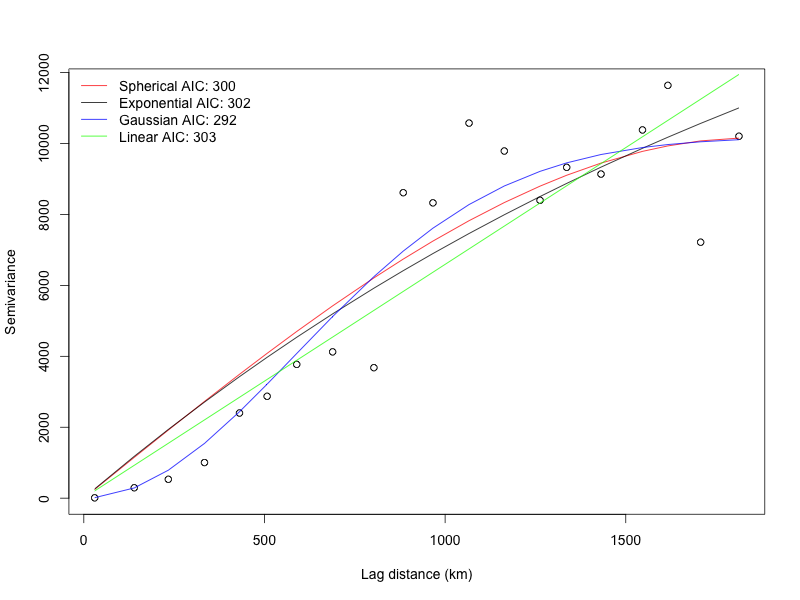
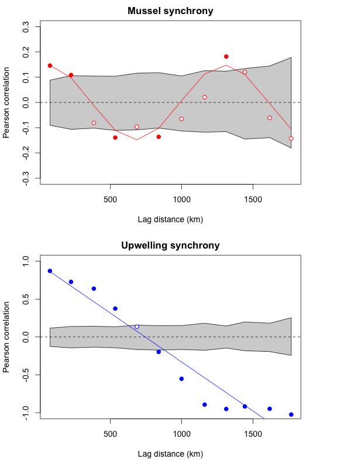

# synchrony
R package for computing spatial, temporal, and spatiotemporal statistics

The synchrony package provides tools for computing spatial, temporal,
and spatiotemporal statistics in [R]. All of the functions are documented
in the [manual], so I will highlight just a few here. One of the primary
objectives of the synchrony package is to quantify how ecological and
environmental patterns decay with distance. To that end, the synchrony
package allows users to compute semivariograms and correlograms on univariate
datasets using a suite of metrics (e.g., covariance, correlation, semivariance).
Users can also fit a number of different models to empirical variograms.




The figure above shows how the semivariance of upwelling currents along
the West coast of the US varies with lag distance. The gaussian model
appears to be the best based on AIC (with the spherical model following
closely behind). Cross-correlograms can also be used to determine the spatial
relationship between two variables. Finally, variograms and cross-variograms
can be calculated for either univariate (single observation at each location)
or multivariate (multiple observations at each location) datasets. Multivariate
correlograms have been used extensively to quantify spatial synchrony in ecology.



The figure above shows that the spatial synchrony of mussel cover is
nonlinear (periodic) whereas that of upwelling is linear. Statistically
significant values are computed via Monte Carlo randomizations and indicated
with filled circles.

To download the development version of the package, visit the [download page]
or type the following at the R command line:
```{r}
install.packages("devtools")
library(devtools)
install_github("tgouhier/synchrony")
```

Once this package makes it out of beta, it will be submitted to [CRAN]
and you will be able to download the release version by typing the following
at the R command line:
```{r}
install.packages("synchrony")
```

## References

[R]: http://www.r-project.org/
[manual]: http://synchrony.r-forge.r-project.org/synchrony-manual.pdf
[download page]: https://r-forge.r-project.org/R/?group_id=1370
[CRAN]: http://cran.r-project.org/web/packages/synchrony/index.html

<a id="Bjornstad2001"/>
Bjornstad, O. N., and W. Falck. 2001.
**Nonparametric spatial covariance functions: Estimation and testing.**
Environmental and Ecological Statistics

<a id="Bjornstad1999"/>
Bjornstad, O. N., R. A. Ims, and X. Lambin. 1999.
**Spatial population dynamics: analyzing patterns and processes of population synchrony.**
Trends in Ecology & Evolution 14:427-432.

<a id="Buonaccorsi2001"/>
Buonaccorsi, J. P., J. S. Elkinton, S. R. Evans, and A. M. Liebhold. 2001.
**Measuring and testing for spatial synchrony.**
Ecology 82:1668-1679.

<a id="Cazelles2003"/>
Cazelles, B., and L. Stone. 2003.
**Detection of imperfect population synchrony in an uncertain world.**
Journal of Animal Ecology 72:953-968.

<a id="Fortin2005"/>
Fortin, M. J., and M. R. T. Dale. 2005.
**Spatial Analysis: A Guide for Ecologists.**
Cambridge University Press.

<a id="Gouhier2007"/>
Gouhier, T. C., and F. Guichard. 2007.
**Local disturbance cycles and the maintenance of spatial heterogeneity across scales in marine metapopulations.**
Ecology 88:647-657.

<a id="Gouhier2010"/>
Gouhier, T. C., F. Guichard, and A. Gonzalez. 2010.
**Synchrony and stability of food webs in metacommunities.**
The American Naturalist 175:E16-E34.

<a id="Gouhier2010"/>
Gouhier, T. C., F. Guichard, and B. A. Menge. 2010.
**Ecological processes can synchronize marine population dynamics over continental scales.**
Proceedings of the National Academy of Sciences 107:8281-8286.

<a id="Loreau2008"/>
Loreau, M., and C. de Mazancourt. 2008.
**Species synchrony and its drivers: Neutral and nonneutral community dynamics in fluctuating environments.**
The American Naturalist 172:E48-E66.

<a id="Vasseur2007"/>
Vasseur, D. A. 2007.
**Environmental colour intensifies the Moran effect when population dynamics are spatially heterogeneous.**
Oikos 116:1726-1736.

<a id="Zar1999"/>
Zar, J. H. 1999.
**Biostatistical Analysis, Fourth edition.**
Prentice-Hall, Inc., Upper Saddle River, NJ.

## Other links
 * Paper from Tarik C. Gouhier and Frederic Guichard: http://onlinelibrary.wiley.com/doi/10.1111/2041-210X.12188/pdf
 * Old r-forge website: http://synchrony.r-forge.r-project.org/
